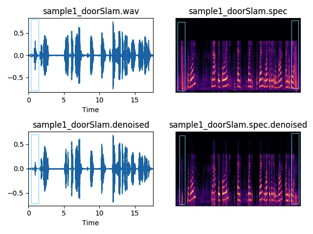

## AM_GAN: Enhancing Acoustic Model for Children with Generative Adversarial Network

### Introduction

This is the repository for enhancing Acoustic Model with Generative Adversarial Network. In this project, we invetigate to train GAN to denoise audio and then use Li-GRU model to build the acoustic model.

The generator inside the GAN is a convolutional layer based encoder-decoder, and the discriminator is a classification model to predict the audio is noisy or not.  The generator can learn to clean the noise (or add more noise) with the help of discrimiator. We built the GAN with Tensorflow. After we train the discriminator with supervised clean/noisy audios, we then train the generator to produce more audio samples.

Light Gated Recurrent Unit (Li-GRU) network is used to train the acoustic model. We use FMLLR, CMVN and 5-layer GRU layer to build the model, together with dropout and batch normalization. We use Kaldi-5 and Pytorch to implement this model. 


### Dependencies
* Kaldi 5.x
* Pytorch 1.1
* Python 2.7 (for TensorFlow) and 3.6( for Pytorch)
* TensorFlow 0.12


### Data

Audios are coded with 8Kbps, 8 bit, PCM, .wav format. We train the GAN with 20 hours data, and the Li-GRU is trained with 200 hours data.


### GAN Training

Sample command line to train can be :

```
python main.py --init_noise_std 0. --save_path AM_GAN \
               --init_l1_weight 100. --batch_size 50 --g_nl prelu \
               --save_freq 50 --preemph 0.95 --epoch 86 --bias_deconv True \
               --bias_downconv True --bias_D_conv True
```

### Denoising

Here is the sample command to denoise an audio:

```
CUDA_VISIBLE_DEVICES="0" python main.py --init_noise_std 0. \
					--save_path AM_GAN  \
					--batch_size 100 \
					--g_nl prelu \
					--weights SEGAN-50 \
					--test_wav sourcefile.wav \
					--clean_save_path clean
```

### Evaluation

Sample audios are in ./Sample. An example of noise of background door slam is clearly mitigated between the noisy audio and the cleaned audio at t=0.83s. 

Noisy audio:



### Li-GRU training

Dockerfile is uploaded to host the acoustic model training. The docker container will pull Pytorch 1.1 and Kaldi-5.x. After container is launched, the run.recipe.sh will be excuted inside the container. Log can be tailed in ./common, ./children_kaldi and ./children_kalditorch. 

Command to build docker image, in the same directory of Dockerfile:

```
docker build -t image_name .
```

Scripts script.all.sh in directory common is to do the pre-processing of data, split dataset(script.trans.sh), build language model (if necessary, script.lang.sh) and prepared the dictionary. We fix the language model when evaluate the effect of GAN. script.wav.sh is to convert audio format if needed.


```
cd /storage/Work/common
bash script.all.sh > script.all.log 2> script.all.err
```


Scripts in children_kaldi(run.sh) follows the procedure in Kaldi framwork. It generates the MFCC/FMLLR features, CMVN nomalization, and train a basic neural network. run.dev.sh is the decoding process one dev set.

```
cd /storage/Work/Children_kaldi
bash run.sh > run.log 2> run.err
bash run.dev.sh > run.dev.log 2> run.dev.err
```

Scripts in children_kalditorch(run.sh) is to build Li-GRU layers with pytorch based on the neural network output from hildren_kaldi. 

```
cd /storage/Work/Children_kalditorch
bash run.sh > run.log 2> run.err
```

Pytorch files to build the Li-GRU is 
```
python3 run_exp.py cfg/children/liGRU_fmllr.cfg
```

liGRU_fmllr.cfg has the configuration of the Li-GRU layers. Here are the most important part:

```
	ligru_lay = 550,550,550,550,550
	ligru_drop = 0.2,0.2,0.2,0.2,0.2
	ligru_use_laynorm_inp = False
	ligru_use_batchnorm_inp = False
	ligru_use_laynorm = False,False,False,False,False
	ligru_use_batchnorm = True,True,True,True,True
	ligru_bidir = True
	ligru_act = relu,relu,relu,relu,relu
	ligru_orthinit=True

	arch_lr = 0.0002
	arch_halving_factor = 0.5
	arch_improvement_threshold = 0.001
	arch_opt = rmsprop
	opt_momentum = 0.0
	opt_alpha = 0.95
	opt_eps = 1e-8
	opt_centered = False
	opt_weight_decay = 0.0
```

In this project, GAN has been proved powerful to do the speech augmentation. Together with Li-GRU network, it shows significant improvement on the acoustic model for children. 